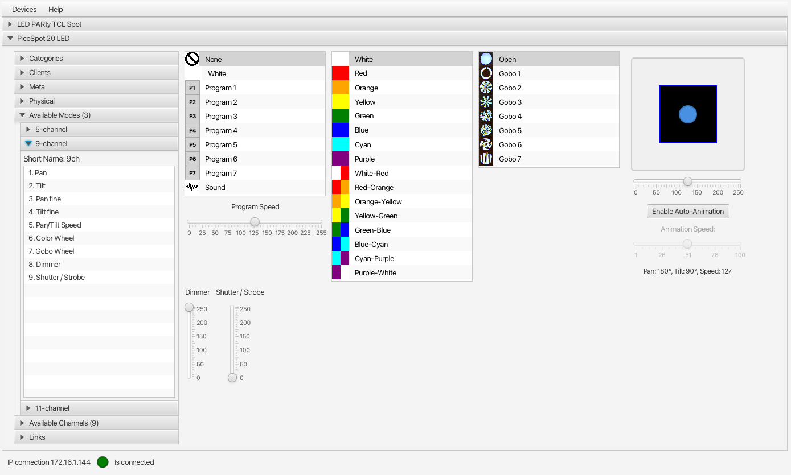

# DMX512 Java Library

Java library for the DMX512 protocol and Open Fixture Library (OFL).

**THIS PROJECT IS IN AN EARLY STAGE! BREAKING CHANGES ARE EXPECTED...**

This library can be used to connect with USB-to-DMX and IP-to-DMX controllers. It can load fixture definitions from the [Open Fixture Library](https://open-fixture-library.org/) to easily create a Java (user interface) application that can interact with many types of DMX devices.

## Learn More

### Blog Posts

* 2025-07-17: [Introducing a New Java DMX512 Library With Demo JavaFX User Interface](https://webtechie.be/post/2025-07-17-introducing-java-dmx512-library-with-demo-javafx-ui/).
* 2025-07-29: [Release V0.0.2 of Java DMX512 Library With Universes and USB-to-DMX support](https://webtechie.be/post/2025-07-29-java-dmx512-library-v0.0.2-universes-and-usb/)
 
### Videos

* 2025-07-17: Introduction video with a full explanation

[](https://www.youtube.com/watch?v=ztrO3Crexmg)

* 2025-07-29: How to use universes with an IP-to-DMX controller

[](https://www.youtube.com/watch?v=slC4niKWUq0)

* 2025-07-29: How to use a USB-to-DMX controller

[](https://www.youtube.com/watch?v=q7T66fzsym0)


## Computer to DMX Controllers

### Tested with V0.0.2

* IP-to-DMX
  * [JUNELIONY ArtNet 1024 2-Port Sulite DMX LAN512 2-Port ArtNet Converter](https://www.amazon.com.be/dp/B0CYPQ2Z4V) with ArtNet protocol
* USB-to-DMX
  * [DSD TECH SH-RS09B USB to DMX Cable for Freestyler QLC MagicQ and Pi Open Lighting](https://www.amazon.com.be/dp/B0F2MQZCWR)

### Still TODO

* IP-to-DMX
  * Other devices and protocols
* USB-to-DMX
  * [Enttec Open DMX USB Interface](https://www.thomann.de/be/enttec_open_dmx_usb_interface.htm)
  * Other devices and protocols

## Fixtures

Uses the [Open Fixture Library (OFL)](https://open-fixture-library.org/) to create DMX fixtures as Java objects. Fixtures can be parsed from the [OFL JSON format](https://github.com/OpenLightingProject/open-fixture-library/blob/master/docs/fixture-format.md).

### Test Setup

This library is tested with various controllers (IP-to-DMX and USB-to-DMX) with the following fixtures

* Two [Fun Generation PicoSpot 20 LED](https://www.thomann.de/be/fun_generation_picospot_20_led.htm)
  * DMX address 1 and 12
* Two [Eurolite LED PARty TCL Spot](https://www.thomann.de/be/eurolite_led_party_tcl_spot.htm)
  * DMX address 23 and 28

For most tests they are connected to one controller. For the universe-ID-test they are split into two chains.

## Sample Use

Below you can find some sample implementations based on this library. Check [Main.java](src/main/java/be/codewriter/dmx512/Main.java) and the [demo directory](src/main/java/be/codewriter/dmx512/demo) for more of these examples. 

### Send Raw Data

You can send a byte array directly via the controller. Create an array with the expected length by your device and fill in the values. 

This is an example for a PicoSpot on channel 1 = the data starts at index 0 of the byte array.

```java
var controller = new DMXIPController(InetAddress.getByName("172.16.1.144"));

// The PicoSpot on DMX channel 1 expects 11 values
/*
"Pan",
"Tilt",
"Pan fine",
"Tilt fine",
"Pan/Tilt Speed",
"Color Wheel",
"Gobo Wheel",
"Dimmer",
"Shutter / Strobe",
"Program",
"Program Speed"
*/
// Set all to 0
controller.render(new byte[]{(byte) 0, (byte) 0, 0, 0, 0, 0, 0, 0, 0, 0, 0});
sleep(2_000);
// Set pan and tilt to 127
controller.render(new byte[]{(byte) 127, (byte) 127, 0, 0, 0, 0, 0, 0, 0, 0, 0});
sleep(2_000);
// Set color wheel to 44 and dimmer full op
controller.render(new byte[]{0, 0, 0, 0, 0, (byte) 44, 0, (byte) 255, 0, 0, 0});
```

### Using Fixtures and Modes

By using a fixture, loaded from an OFL file, it becomes a lot easier to change the data. You can use the name of the channel (e.g. "red", "dimmer", ...) and don't need to know the index of the data in the byte array.

This is a minimal example:

```java
var controller = new DMXIPController(InetAddress.getByName("172.16.1.144"));

// Load a fixture
var fixtureFile = new File("/your/path/to/led-party-tcl-spot.json");
Fixture fixture = OFLParser.parse(fixtureFile);

// Create a DMX client based on the fixture, a mode, and DMX channel (23 in this example)
DMXClient client = new DMXClient(fixture, fixture.modes().getFirst(), 23);

// Create a universe (by ID) with the client(s)
// Most controllers will use universe 0, except when they have multiple connections
DMXUniverse universe = new DMXUniverse(0, client);

// This fixture has only one mode with the following channels:
// "channels": [
//   "Red",
//   "Green",
//   "Blue",
//   "Dimmer",
//   "Effects"
// ]

// Set all channels to 0, except dimmer full open (255)
client.reset();
client.setValue("dimmer", (byte) 255);
controller.render(universe);
Thread.sleep(1_000);

// Setting RED
client.setValue("red", (byte) 255);
controller.render(universe);
Thread.sleep(3_000);

// Fade RED down
for (int i = 255; i >= 0; i--) {
  client.setValue("red", (byte) i);
  controller.render(universe);
  Thread.sleep(25);
}

controller.close();
```

### User Interface Demo

You can find an example of a user interface with JavaFX to control DMX512 fixtures in the [DMX512-Demo repository](https://github.com/codewriterbv/DMX512-Demo).



## Using this Library in your Project

You can get this library from the Maven repository:

```xml
<dependency>
    <groupId>be.codewriter</groupId>
    <artifactId>dmx512</artifactId>
    <version>${dmx512.version}</version>
</dependency>
```

## About

Created by [CodeWriter bv](https://codewriter.be/).
